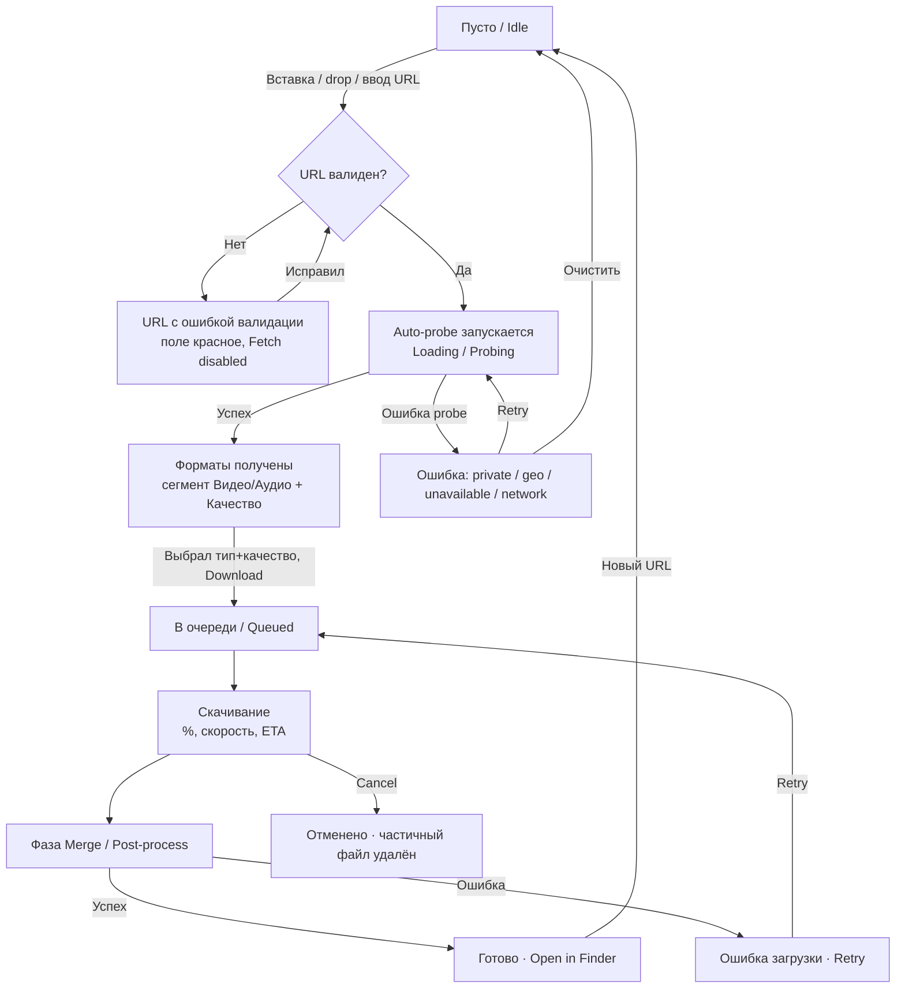

# grably — UI/UX Spec

Нативное macOS-приложение для скачивания видео/аудио с YouTube и подобных сайтов. SwiftUI, macOS 13+. Целевая эстетика — Transmission / Downie / CleanShot: спокойный системный chrome, один accent, никакого «веб-градиента».

Bundle: `com.grably.app` · Deployment: macOS 13.0 · Scenes: `WindowGroup` + `Settings`.

---

## 0. Принципы

1. **Нативность прежде красоты.** Только системные материалы, semantic colors, стандартные контролы (`.bordered`, `Picker`, `List`). Кастомим лишь прогресс-строку и иконку приложения.
2. **Один экран — один поток.** Всё главное действие (вставил → probe → выбрал → скачал) живёт в одном окне без модалок. Настройки — отдельная Settings scene по ⌘,.
3. **Прогрессивное раскрытие.** До валидного URL видно только поле ввода + пустой список. Форматы появляются только после probe.
4. **Клавиатура — первый класс.** Вставка, Fetch, Download, Cancel — всё с горячими клавишами.

---

## 1. User Flow

### Цель
Пользователь получает локальный файл (видео или аудио) из URL за минимум действий: вставка → выбор качества → одна кнопка.

### Entry points
- Вставка URL в поле (⌘V или контекстное меню).
- Drag&drop ссылки (текст/URL) из браузера в окно.
- Запуск приложения с URL уже в буфере обмена → предложение «Вставить из буфера» (см. 5.3).

### Диаграмма



### Состояния (единая машина верхней панели)

| Состояние | Триггер | Что видно |
|-----------|---------|-----------|
| `idle` | старт / очистка | Placeholder в поле, подсказка «Вставьте ссылку на видео» |
| `invalidURL` | текст не URL | Поле с `.red` border, иконка `exclamationmark.triangle`, Fetch disabled |
| `probing` | валидный URL (авто, дебаунс 600 мс) | Спиннер + «Анализ ссылки…», поле заблокировано, кнопка Cancel probe |
| `ready` | probe успешен | Превью (тайтл, длительность, thumbnail), сегмент Видео/Аудио, Качество, Download активна |
| `probeError` | yt-dlp вернул ошибку | Inline-баннер с текстом причины + Retry/Очистить |
| `downloading` | нажат Download | Строка в списке: прогресс-бар, %, скорость, ETA |
| `merging` | ffmpeg объединяет | Та же строка: indeterminate-бар, «Объединение аудио и видео…» |
| `done` | файл записан | Строка зелёная-галочка, «Open in Finder», «Reveal» |
| `downloadError` | ffmpeg/сеть упали | Строка красная, текст ошибки, Retry |
| `cancelled` | Cancel | Строка серая «Отменено», Retry |

### Screen states matrix

| Область | Empty | Loading | Error | Success |
|---------|-------|---------|-------|---------|
| URL-панель | ✓ placeholder | ✓ probing spinner | ✓ inline-баннер | ✓ превью |
| Панель форматов | скрыта | скрыта | скрыта | ✓ сегмент+picker |
| Список загрузок | ✓ empty-state | ✓ строка-прогресс | ✓ строка-ошибка | ✓ строка-done |

### Edge cases
- **Нет форматов нужного типа** (например, только аудио-стрим): сегмент «Видео» disabled с tooltip «Видео недоступно для этой ссылки».
- **Плейлист вставлен**: MVP берёт первый элемент, под превью показываем note «Это плейлист — будет скачан первый ролик». (полноценный плейлист — вне MVP).
- **Дубликат**: если такой URL+формат уже done — предупреждение «Файл уже скачан. Скачать снова?».
- **Уход из очереди**: закрытие окна при активной загрузке — sheet «Загрузка выполняется. Отменить и выйти?» (Cancel остаётся в фоне, приложение не quit'ается на закрытие окна — стандартно для macOS; quit по ⌘Q с тем же подтверждением).
- **Нет места на диске**: ошибка загрузки с сообщением «Недостаточно места на диске».
- **yt-dlp отсутствует/устарел**: глобальный баннер сверху «yt-dlp не найден» / «Доступно обновление» с кнопкой в Настройки.

---

## 2. Макеты экранов

### 2.1 Главное окно

Размеры:
- **Default:** 720 × 560 pt
- **Min:** 560 × 440 pt
- **Max:** без ограничения (список тянется), но контент-колонка форматов capped на 720 pt по ширине.
- `windowResizability(.contentMinSize)`, стиль `.titleBar` со стандартным traffic-light, `toolbar` с unified-баром.

Общий layout: вертикальный стек — **Toolbar → URL-панель → Панель форматов (условная) → Divider → Список загрузок (растёт)**.

#### Состояние `idle` (пусто)

```
┌──────────────────────────────────────────────────────────────┐
│ ●●●   grably                                        ⚙︎  ↻      │  ← toolbar
├──────────────────────────────────────────────────────────────┤
│                                                                │
│  ┌────────────────────────────────────────────┐  ┌────────┐   │
│  │ 🔗  Вставьте ссылку на видео…               │  │ Fetch  │   │  ← URLInputView
│  └────────────────────────────────────────────┘  └────────┘   │
│                                                                │
├──────────────────────────────────────────────────────────────┤
│                                                                │
│                        ⬇  (arrow.down.circle)                  │
│                                                                │
│                 Пока нет загрузок                              │  ← empty state
│        Вставьте ссылку сверху, чтобы начать                   │
│                                                                │
│                                                                │
└──────────────────────────────────────────────────────────────┘
```

#### Состояние `probing`

```
┌──────────────────────────────────────────────────────────────┐
│  ┌────────────────────────────────────────────┐  ┌────────┐   │
│  │ 🔗  https://youtube.com/watch?v=…           │  │ ◌ …    │   │  ← spinner в кнопке
│  └────────────────────────────────────────────┘  └────────┘   │
│                                                                │
│     ◌  Анализ ссылки…                              [ Отмена ]  │
├──────────────────────────────────────────────────────────────┤
│  … список без изменений …                                     │
└──────────────────────────────────────────────────────────────┘
```

#### Состояние `ready` (форматы получены)

```
┌──────────────────────────────────────────────────────────────┐
│  ┌────────────────────────────────────────────┐  ┌────────┐   │
│  │ 🔗  https://youtube.com/watch?v=dQw4w9WgXcQ │  │ Fetch  │   │
│  └────────────────────────────────────────────┘  └────────┘   │
│                                                                │
│  ┌──────┐  Never Gonna Give You Up                            │
│  │thumb │  Rick Astley · 3:33                                 │  ← MediaPreviewView
│  └──────┘                                                      │
│                                                                │
│   ┌───────────────┬───────────────┐                           │
│   │  ▶︎ Видео      │   ♫ Аудио      │      ← segmented (тип)    │
│   └───────────────┴───────────────┘                           │
│                                                                │
│   Качество  [ 1080p · mp4        ▾ ]     Размер ≈ 48 MB       │  ← QualityPicker
│                                                                │
│                                        ┌──────────────────┐    │
│                                        │  ⬇  Download     │    │  ← primary CTA
│                                        └──────────────────┘    │
├──────────────────────────────────────────────────────────────┤
│  … список загрузок …                                          │
└──────────────────────────────────────────────────────────────┘
```

#### Состояние `downloading` / список с активной строкой

```
├──────────────────────────────────────────────────────────────┤
│  Загрузки                                                      │
│                                                                │
│  ┌──────────────────────────────────────────────────────────┐ │
│  │ ▶︎  Never Gonna Give You Up                         ⊗     │ │  ← DownloadRowView
│  │     1080p · mp4                                            │ │
│  │     ▓▓▓▓▓▓▓▓▓▓▓▓░░░░░░░░░░░  62%                          │ │
│  │     8.4 MB/s · осталось 0:06                               │ │
│  └──────────────────────────────────────────────────────────┘ │
│                                                                │
│  ┌──────────────────────────────────────────────────────────┐ │
│  │ ♫  Some Podcast Episode                            ✓      │ │  ← done
│  │     mp3 · 128 kbps · 42 MB                                 │ │
│  │     Готово               [ Показать в Finder ]            │ │
│  └──────────────────────────────────────────────────────────┘ │
└──────────────────────────────────────────────────────────────┘
```

#### Состояние `merging`

```
│  │ ▶︎  Never Gonna Give You Up                         ⊗     │ │
│  │     1080p · mp4                                            │ │
│  │     ▓▓▓▓▓▓▓▓▓▓▓▓▓▓▓▓▓▓▓▓  (indeterminate)                │ │
│  │     Объединение аудио и видео…                            │ │
```

#### Состояние `probeError` (inline-баннер вместо панели форматов)

```
│  ┌────────────────────────────────────────────┐  ┌────────┐   │
│  │ 🔗  https://youtube.com/watch?v=…           │  │ Fetch  │   │
│  └────────────────────────────────────────────┘  └────────┘   │
│                                                                │
│  ┌──────────────────────────────────────────────────────────┐ │
│  │ ⚠︎  Видео недоступно                                       │ │  ← ErrorBanner
│  │     Ролик приватный или удалён. Проверьте ссылку.         │ │
│  │                              [ Очистить ]   [ Повторить ] │ │
│  └──────────────────────────────────────────────────────────┘ │
```

Тексты причин ошибок probe (маппинг из stderr yt-dlp):
| Причина | Заголовок | Пояснение |
|---------|-----------|-----------|
| private/removed | «Видео недоступно» | «Ролик приватный или удалён. Проверьте ссылку.» |
| geo-block | «Недоступно в вашем регионе» | «Владелец ограничил доступ по стране.» |
| age-restricted | «Требуется подтверждение возраста» | «Это видео с возрастным ограничением.» |
| network | «Нет соединения» | «Проверьте интернет и повторите.» |
| unsupported | «Сайт не поддерживается» | «Не удалось распознать ссылку.» |
| yt-dlp missing | «yt-dlp не найден» | «Откройте Настройки, чтобы установить.» |

### 2.2 Окно настроек (Settings scene, ⌘,)

Стиль: стандартный `Settings` с `TabView(.automatic)` → на macOS даёт нативную панель с иконками-табами вверху. MVP — один-два таба.

Размер: фиксированный ~ 480 × 320 pt (Settings scene не ресайзится по контенту автоматически — задаём `.frame`).

```
┌───────────────────────────────────────────────┐
│   [ ⚙︎ Общие ]     [ ⇩ Загрузки ]              │  ← TabView tabs
├───────────────────────────────────────────────┤
│                                                │
│   Папка загрузок                               │
│   ┌───────────────────────────────┐ ┌───────┐ │
│   │ 📁  ~/Downloads/grably         │ │ Выбрать│ │  ← folder picker
│   └───────────────────────────────┘ └───────┘ │
│                                                │
│   Формат по умолчанию                          │
│   Тип       ( ◉ Видео    ○ Аудио )             │
│   Качество  [ 1080p · mp4          ▾ ]         │
│                                                │
│   ────────────────────────────────────────    │
│                                                │
│   Движок yt-dlp                                │
│   Версия  2026.06.20            ● актуально    │
│                              ┌──────────────┐  │
│                              │  Обновить     │  │  ← update button
│                              └──────────────┘  │
│                                                │
└───────────────────────────────────────────────┘
```

Состояния кнопки «Обновить»:
- `idle`: «Обновить» + справа статус (`● актуально` зелёный / `● доступно 2026.07.01` accent).
- `checking`/`updating`: спиннер + «Обновление…», кнопка disabled.
- `done`: галочка + «Обновлено до 2026.07.01» (авто-скрытие через 3 с).
- `error`: `● ошибка обновления` `.red` + tooltip.

---

## 3. Компонентная спека (SwiftUI)

Иерархия:
```
ContentView
├─ HeaderBanner (условный: yt-dlp missing/update)
├─ URLInputView            // поле + Fetch
├─ MediaPreviewView        // thumbnail + title + duration (ready)
├─ FormatSelectionView
│   ├─ MediaTypeSegment    // Видео | Аудио
│   └─ QualityPicker       // Picker разрешение/битрейт
│   └─ DownloadButton      // primary CTA
├─ ErrorBanner             // probeError
└─ DownloadsListView
    └─ DownloadRowView[]   // строка на задачу
```

### 3.1 `URLInputView`

Назначение: ввод/вставка URL, запуск probe.

- Layout: `HStack` → `TextField` (растянут) + `Button("Fetch")`.
- TextField: `.textFieldStyle(.roundedBorder)`, leading SF Symbol `link` внутри как overlay, placeholder «Вставьте ссылку на видео…».
- Поведение:
  - `onChange(text)` → валидация URL (regex/`URLComponents`, схема http/https + известный хост-паттерн). Дебаунс 600 мс → авто-probe (см. 5.1).
  - Enter в поле = нажать Fetch (`.onSubmit`).
  - ⌘V работает нативно; при пустом поле и наличии URL в pasteboard — кнопка «Вставить» (см. 5.3).
- Состояния:
  | Состояние | TextField | Кнопка |
  |-----------|-----------|--------|
  | idle | обычный | «Fetch», disabled (пусто) |
  | invalid | `.red` border overlay | «Fetch» disabled |
  | valid | обычный | «Fetch» enabled |
  | probing | disabled, dimmed | ProgressView внутри, текст скрыт |
- Disabled-логика Fetch: `text.isEmpty || !isValidURL || state == .probing`.
- Accent: `.tint(.accentColor)` на кнопке; стиль `.borderedProminent` только если авто-probe отключён (иначе `.bordered`, т.к. авто-probe делает Fetch вторичным).

### 3.2 `MediaPreviewView`

- `HStack`: thumbnail `AsyncImage` 96 × 54 pt (16:9), `cornerRadius 6`, placeholder — `photo` в `secondary`.
- VStack: title `.headline` (lineLimit 2), «uploader · duration» `.subheadline .foregroundStyle(.secondary)`.
- Появление: `.transition(.opacity.combined(with: .move(edge: .top)))`.

### 3.3 `MediaTypeSegment` (Видео | Аудио)

- `Picker("", selection:).pickerStyle(.segmented)`, 2 сегмента.
- Лейблы с иконками: «Видео» + `video`, «Аудио» + `music.note`.
- Ширина: `fixedSize` или max 280 pt, выравнивание leading.
- Смена типа → `QualityPicker` перестраивает список опций и сбрасывает выбор на дефолт для типа.
- Disabled-сегмент: если для типа нет форматов — сегмент недоступен (custom: показать оба, но при выборе пустого — placeholder «Нет доступных форматов»). Проще: `disabled` весь сегмент если тип пуст, с `help()` tooltip.

### 3.4 `QualityPicker`

- `Picker("Качество", selection:)` menu-style (`.pickerStyle(.menu)`).
- Опции для **Видео**: `2160p · mp4`, `1440p · mp4`, `1080p · mp4`, `720p · mp4`, `480p · mp4` — только реально доступные из probe. Каждая строка: разрешение + контейнер + примерный размер (`≈ 48 MB`) справа `.secondary`.
- Опции для **Аудио**: `MP3 · 320 kbps`, `MP3 · 192 kbps`, `M4A · 256 kbps` — из доступных.
- Справа от пикера — лейбл «Размер ≈ N MB» (если yt-dlp дал `filesize`/`filesize_approx`; иначе скрыт).
- Дефолт: из Настроек (`defaultType`/`defaultQuality`), при отсутствии — наилучшее ≤ 1080p.

### 3.5 `DownloadButton`

- `Button` `.buttonStyle(.borderedProminent)`, `.controlSize(.large)`, `.tint(.accentColor)`.
- Лейбл: `Label("Download", systemImage: "arrow.down.circle.fill")`.
- Хоткей: ⌘↩ (`.keyboardShortcut(.return, modifiers: .command)`).
- Disabled если: нет выбранного формата, идёт probe, или активна другая загрузка **и** политика «одна за раз» + очередь заполнена (тогда лейбл «В очередь»). В MVP: если уже что-то качается — кнопка становится «Добавить в очередь» (тот же primary, ставит в pending).

### 3.6 `DownloadRowView`

Строка задачи. Высота ~ 72–88 pt, `padding 12`, фон `.background(.quaternary)` c `cornerRadius 8` или обычная `List` строка с `insetGrouped`-подобным видом.

Анатомия:
```
┌────────────────────────────────────────────────────────┐
│ [type]  Title (lineLimit 1, .body)                 [X]  │
│         subtitle: quality · container (.caption sec.)   │
│         ▓▓▓▓▓░░░░  62%                                   │
│         8.4 MB/s · осталось 0:06        (.caption sec.)  │
└────────────────────────────────────────────────────────┘
```
- Leading иконка типа: `video.fill` (видео) / `music.note` (аудио), `.foregroundStyle(.secondary)`, 20 pt.
- Прогресс-бар: `ProgressView(value:)` `.progressViewStyle(.linear)` `.tint(.accentColor)`, высота 4 pt. В `merging` — `ProgressView()` без value (indeterminate) с тем же tint.
- Trailing action по состоянию:
  | Состояние | Trailing | Нижняя строка |
  |-----------|----------|---------------|
  | queued | `xmark.circle` (отмена) | «В очереди» |
  | downloading | `xmark.circle` | «8.4 MB/s · осталось 0:06» |
  | merging | (кнопка отмены dimmed/скрыта) | «Объединение аудио и видео…» |
  | done | (нет X) | «Готово» + `[Показать в Finder]` |
  | error | `arrow.clockwise` (retry) | текст ошибки `.red` |
  | cancelled | `arrow.clockwise` (retry) | «Отменено» `.secondary` |
- Статус-иконка справа от title при завершении: `checkmark.circle.fill` `.green` / `exclamationmark.circle.fill` `.red`.
- «Показать в Finder»: `Button(.link)` стиль или `.bordered` `.small`, вызывает `NSWorkspace.activateFileViewerSelecting`.
- Контекстное меню (right-click): «Показать в Finder», «Скопировать ссылку», «Скачать снова», «Удалить из списка».
- Hover: подсветка строки `.background(.selection.opacity(0.5))` и появление кнопки удаления `xmark` в дальнем углу.
- Свайп в `List` (`.swipeActions`): удалить из списка (`trash`, `.destructive`).

### 3.7 `DownloadsListView`

- `List` со строками; header «Загрузки» (`.font(.headline)`), справа — «Очистить завершённые» (`.link`, показывается если есть done/error/cancelled).
- Empty-state (`ContentUnavailableView`-подобный на 13/14, кастом на 13): иконка `arrow.down.circle` 48 pt `.secondary`, «Пока нет загрузок», подпись.
- Порядок: активная сверху, затем очередь, затем история (новые сверху).

### 3.8 `HeaderBanner` (глобальный)

- Тонкая полоса под toolbar, `.background(.yellow.opacity(0.15))` (warning) / `.accentColor.opacity(0.12)` (info).
- Иконка `exclamationmark.triangle.fill` + текст + `Button` в Настройки. Появляется только для yt-dlp missing / update available.

---

## 4. Визуальный язык

### 4.1 Цвет

Только **semantic system colors** + один accent. Accent задан в asset-каталоге (`AccentColor`) — рекомендую тёплый оранжево-янтарный (grably = «grab», хватательный, энергичный), например базовый `#FF8A3D` (light) / `#FF9E5E` (dark). Он не конфликтует с системным синим и читается как бренд.

| Токен | SwiftUI | Использование |
|-------|---------|---------------|
| Accent | `Color.accentColor` | CTA, прогресс-бар, выбранный сегмент, ссылки-бренд |
| Text primary | `.primary` | Заголовки, значения |
| Text secondary | `.secondary` | Мета, подписи, размеры |
| Background window | `Color(nsColor: .windowBackgroundColor)` | Фон окна |
| Surface | `.background(.quaternary)` / `.regularMaterial` | Карточки строк, панель форматов |
| Separator | `Color(nsColor: .separatorColor)` / `Divider()` | Разделители |
| Success | `.green` (`Color(nsColor: .systemGreen)`) | Готово, «актуально» |
| Warning | `.yellow`/`.orange` | Баннер обновления |
| Destructive/Error | `.red` (`.systemRed`) | Ошибки, удаление, отмена-иконка |
| Field error border | `.red` | Невалидный URL |

Правила:
- Не хардкодить hex в UI (кроме asset-каталога accent). Всё остальное — semantic → тёмная тема и Increase Contrast работают бесплатно.
- Прогресс-бар всегда accent; фаза merge — тот же accent indeterminate.
- Статусы дублируются иконкой + текстом (не только цветом) — см. Accessibility.

### 4.2 Типографика (SF, системный `Font`)

| Роль | Font | Пример |
|------|------|--------|
| Заголовок секции | `.headline` (~13 pt semibold) | «Загрузки» |
| Заголовок медиа | `.headline` | title ролика |
| Body / кнопки | `.body` (13 pt) | лейблы |
| Мета/подписи | `.subheadline` / `.caption` `.secondary` | «Rick Astley · 3:33», «8.4 MB/s» |
| Проценты в строке | `.caption.monospacedDigit()` | «62 %» — обязательно monospaced digits, чтобы не дёргалось |
| Скорость/ETA | `.caption.monospacedDigit() .secondary` | «8.4 MB/s» |

Используем стандартную системную шкалу — она уже адаптируется под Dynamic Type / Accessibility text sizes. Никаких фиксированных `.system(size:)` кроме иконок.

### 4.3 Spacing (8-pt сетка)

| Токен | pt | Применение |
|-------|-----|-----------|
| xs | 4 | Иконка↔текст внутри лейбла |
| s | 8 | Между связанными контролами |
| m | 12 | Внутренний padding строки, gap по умолчанию |
| l | 16 | Padding панелей, отступ секций |
| xl | 24 | Между крупными блоками (URL ↔ форматы) |
| Window inset | 20 | Внешние поля контента окна |
| Corner radius | 6 (thumb/inputs), 8 (карточки строк), 10 (баннеры) | |

### 4.4 Иконки (SF Symbols — конкретные имена)

| Назначение | SF Symbol |
|-----------|-----------|
| Ссылка (в поле) | `link` |
| Fetch/анализ | `magnifyingglass` (или спиннер `ProgressView`) |
| Видео (сегмент/строка) | `video` / `video.fill` |
| Аудио (сегмент/строка) | `music.note` |
| Download CTA | `arrow.down.circle.fill` |
| Прогресс/скачивание индикатор | `arrow.down.circle` |
| Отмена задачи | `xmark.circle` (hover: `.fill`) |
| Повтор/retry | `arrow.clockwise` |
| Успех | `checkmark.circle.fill` |
| Ошибка | `exclamationmark.circle.fill` |
| Предупреждение (баннер) | `exclamationmark.triangle.fill` |
| Папка / показать в Finder | `folder` / `arrow.up.forward.app` (reveal) |
| Настройки (toolbar) | `gearshape` |
| Обновить yt-dlp (toolbar) | `arrow.triangle.2.circlepath` |
| Вставить из буфера | `doc.on.clipboard` |
| Плейлист note | `list.bullet` |
| Empty-state | `arrow.down.circle` (48 pt, `.secondary`) |
| Удалить из списка | `trash` |

Toolbar: слева тайтл, справа `gearshape` (открывает Settings) и `arrow.triangle.2.circlepath` (быстрый update-check). Использовать `.toolbar { ToolbarItem(placement: .primaryAction) }`.

### 4.5 Светлая / тёмная тема

Обе поддерживаются автоматически за счёт semantic colors + материалов. Проверить:
- Thumbnail placeholder виден в обеих.
- Прогресс-бар accent контрастен на `windowBackgroundColor` и в dark.
- Error border `.red` не сливается — в dark используется системный `.systemRed` (светлее).
- Materials (`.regularMaterial`) для панели форматов дают корректный vibrancy в обеих темах.

### 4.6 Иконка приложения (концепт)

Концепт «grab»: стилизованная **стрелка-вниз внутри «когтя»/скобки захвата**, вписанная в скруглённый macOS-квадрат (Big Sur squircle, ~22 % corner radius, лёгкий верхний-нижний градиент внутри бренд-оранжевого).

- Форма: squircle с мягкой внутренней тенью сверху (нативный macOS look, не плоский).
- Основной знак: `arrow.down` жирная, обрамлённая двумя короткими «уголками захвата» (как углы рамки выделения, `[  ↓  ]`), белые/светлые на оранжевом фоне.
- Фон: вертикальный градиент accent `#FFB067 → #FF7A29`.
- Наборы размеров: 16, 32, 128, 256, 512 @1x/@2x в `Assets.xcassets/AppIcon`.
- Настроение: дружелюбный, «инструмент», а не «медиаплеер». Читается на 16 pt в доке (силуэт стрелки должен оставаться распознаваемым).

---

## 5. Микро-взаимодействия

### 5.1 Авто-probe vs кнопка Fetch
- **По умолчанию — авто-probe.** При вводе/вставке валидного URL: дебаунс 600 мс → probe стартует автоматически, кнопка Fetch показывает спиннер. Это ключевой «магический» момент как в Downie.
- Кнопка Fetch остаётся как явный fallback (для случая, когда авто-probe отменили или URL тот же). При активном авто-probe Fetch = «Отмена».
- Настройка (опц., не в первом MVP): «Автоматически анализировать вставленные ссылки» toggle.

### 5.2 Drag & drop
- Окно принимает `.onDrop(of: [.url, .plainText])`. Дроп ссылки → вставляет в поле → запускает авто-probe.
- Во время drag-over: поле URL подсвечивается accent-рамкой 2 pt + фон `.accentColor.opacity(0.08)`, курсор copy.

### 5.3 Paste из буфера
- ⌘V в поле — нативно.
- При активации окна/старте, если буфер содержит валидный видео-URL и поле пусто → под полем всплывает тонкая подсказка-чип: `[doc.on.clipboard] Вставить ссылку из буфера` (клик = вставить+probe). Авто-скрытие через 8 с или при ручном вводе.
- Глобальный хоткей на «вставить и скачать» вне MVP.

### 5.4 Hover-состояния
- Строки списка: подсветка фона + проявление кнопки удаления (fade 0.15 с).
- Иконки-действия (cancel/retry): `.opacity` 0.7 → 1.0 и лёгкий scale 1.05 при hover, курсор pointing hand.
- «Показать в Finder»: underline при hover (link-стиль).

### 5.5 Анимация прогресса
- Значение прогресс-бара обновляется через `withAnimation(.linear(duration: 0.3))` при каждом апдейте, чтобы бар «ехал» плавно, а не скакал.
- Проценты — `contentTransition(.numericText())` (macOS 13+) для плавной смены цифр, monospaced digits.
- Переход `downloading → merging`: cross-fade линейного бара в indeterminate (0.25 с).
- Появление панели форматов: `.transition(.opacity + .move(.top))`, `spring(response: 0.35, dampingFraction: 0.85)`.
- Все анимации обёрнуты проверкой `accessibilityReduceMotion` — при включённом Reduce Motion заменяем на мгновенную смену/`.opacity` без движения.

### 5.6 Ошибки
- **Probe-ошибка** → inline `ErrorBanner` на месте панели форматов (не алерт, не тост) — пользователь остаётся в контексте, видит URL и может Retry.
- **Download-ошибка** → строка задачи краснеет, показывает причину + `arrow.clockwise` retry (in-place, без модалок).
- **Критические** (нет yt-dlp, нет места) → `HeaderBanner` сверху или системный `.alert` только если действие блокирующее.

### 5.7 Toast / inline-нотификации
- Успех загрузки: НЕ модальный. Строка получает зелёную галочку + опционально системный `UNUserNotification` «grably · Готово: <title>» с кнопкой «Показать в Finder» (если окно не в фокусе).
- Мелкие подтверждения («Ссылка скопирована», «Список очищен») — тонкий auto-dismiss overlay-чип внизу окна, 2 с, `.regularMaterial`, `.transition(.move(.bottom)+.opacity)`.
- Звук завершения — опционально (Настройки, вне первого MVP).

---

## 6. Accessibility

### 6.1 VoiceOver labels

| Контрол | `accessibilityLabel` | `accessibilityValue` / hint |
|---------|----------------------|-----------------------------|
| URL TextField | «Ссылка на видео» | текущий текст; hint «Вставьте ссылку и нажмите Fetch» |
| Fetch button | «Анализировать ссылку» | во время probe value «Анализ выполняется» |
| Сегмент Видео/Аудио | «Тип загрузки» | «Видео» / «Аудио» выбран |
| Quality picker | «Качество» | напр. «1080p, mp4, примерно 48 мегабайт» |
| Download button | «Скачать» | hint «Начать загрузку выбранного формата» |
| Download row | «<title>, <тип>, <качество>» | value: «Загрузка 62 процента, скорость 8.4 мегабайта в секунду, осталось 6 секунд» |
| Cancel icon | «Отменить загрузку» | — |
| Retry icon | «Повторить загрузку» | — |
| Show in Finder | «Показать в Finder» | — |
| Progress bar | (объединить со строкой, `accessibilityElement(children: .combine)`) | обновляемый value |
| Error banner | «Ошибка: <заголовок>. <пояснение>» | — |

- Прогресс-строку собрать в один VoiceOver-элемент (`.accessibilityElement(children: .combine)`), значение обновлять через `accessibilityValue` + `AccessibilityNotification.Announcement` на смене фазы («Объединение», «Готово»).
- Ошибки анонсировать `.accessibilityAnnouncement` при появлении.

### 6.2 Keyboard navigation
- Полный Tab-order: URL → Fetch → сегмент → Quality → Download → строки списка.
- ⌘V вставка, ↩ = Fetch (onSubmit), ⌘↩ = Download, ⌘. = отмена активной загрузки/probe, ⌘, = Настройки, ⌘W = закрыть окно, ⌘R = обновить probe, Delete на выбранной строке = удалить из списка.
- Все кнопки достижимы с клавиатуры, видимый focus ring (системный `.focusable()` + не отключать focus ring). Сегмент и picker — стрелками.
- Кнопки-иконки (cancel/retry) — `Button`, не `onTapGesture`, чтобы попадать в keyboard/VoiceOver.

### 6.3 Dynamic Type / Increase Contrast
- Только системные `Font` роли (`.headline`, `.body`, `.caption`) → масштабируются под системный размер текста.
- Layout строк — гибкий (`HStack`/`VStack` без фиксированных высот там, где текст; min-высота, не max). При крупном тексте строка растёт, прогресс-бар остаётся на всю ширину.
- Никакой truncation критичной инфы: title `lineLimit(1)` с `.help()`/tooltip полного названия; мета переносится.
- Increase Contrast: semantic colors дают усиленные варианты автоматически; error/success всегда дублируются иконкой + текстом (не только цвет).
- Touch/hit target иконок-действий ≥ 28×28 pt (macOS pointer-минимум; для кнопок задать `.frame(minWidth:28,minHeight:28)` вокруг 16-pt символа).

---

## Чек-лист доступности (перед хендоффом)
- [ ] Контраст текста ≥ 4.5:1 (проверить accent на белом/тёмном для линков)
- [ ] Все действия достижимы с клавиатуры, focus ring виден
- [ ] Статусы не только цветом (иконка + текст)
- [ ] VoiceOver: строка загрузки читается одним осмысленным элементом с живым value
- [ ] Reduce Motion отключает движение/spring
- [ ] Dynamic Type XL не ломает layout URL-панели и строк
- [ ] Прогресс-цифры monospacedDigit (нет дёрганья)
- [ ] Ошибки анонсируются VoiceOver при появлении

---

### Резюме связки с кодом
- Scenes: `WindowGroup { ContentView() }` + `Settings { SettingsView() }`.
- Один `@Observable`/`ObservableObject` `AppModel` держит: `urlText`, `probeState`, `mediaInfo`, `selectedType`, `selectedQuality`, `downloads: [DownloadTask]`.
- `DownloadTask` — Identifiable, `state: enum {queued, downloading(progress,speed,eta), merging, done(url), error(msg), cancelled}` → напрямую драйвит `DownloadRowView`.
- Accent color — подключён через asset-каталог (`AccentColor`), задать бренд-оранжевый в `Assets.xcassets/AccentColor.colorset` с light/dark вариантами.
